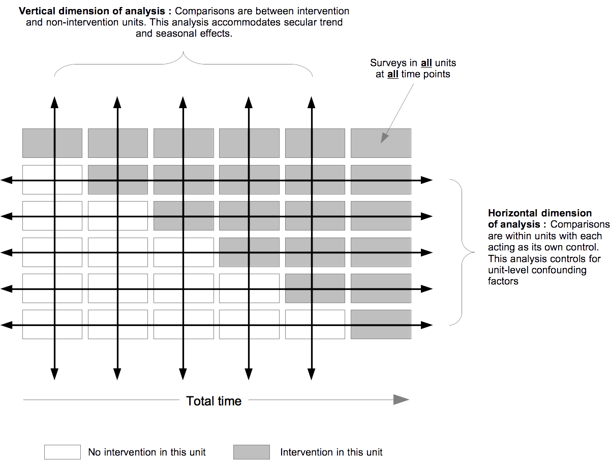

```{r setup, include = FALSE}
options(htmltools.dir.version = FALSE)

if(!require(remotes)) install.packages("remotes")
if(!require(fontawesome)) remotes::install_github("rstudio/fontawesome")
```

```{r xaringan-themer, include = FALSE}
library(xaringanthemer)
mono_light(
  base_color = "#002147",
  title_slide_background_image = "",
  title_slide_background_size = "cover",
  header_font_google = google_font("Fira Sans"),
  text_font_google   = google_font("Fira Sans Condensed"),
  text_font_size = "1.2em",
  code_font_google   = google_font("Fira Mono"),
  text_slide_number_font_size = "0.5em"
)
```

class: inverse, center, middle

`r fontawesome::fa("envelope", fill = "white")` ernest@guevarra.io

`r fontawesome::fa("globe", fill = "white")` ernest.guevarra.io

`r fontawesome::fa("linkedin", fill = "white")` ernestguevarra

---

# Structure of lecture

* Three case studies (one per hour)

In each case study:

* Examine the various considerations for evaluation

* Discuss the possible methods to use for evaluation and their pros and cons

* Present the actual evaluation design used

---

class: inverse, center, middle

## Case Study 1

## Coverage assessment of direct nutrition interventions in Liberia

---

# Background

* On 3 February 2014, the Republic of Liberia joined the Scaling Up Nutrition (SUN) Movement

* Liberia had developed a National Nutrition Policy which was designed to complement and strengthen actions set out in the Nutrition Health Policy and the Food Security and Nutrition Strategy

* Liberia's 2012 Poverty Reduction Strategy (PRS) had also identified nutrition as a national priority and an integral element of the overall development agenda

---

# Programme in support of nutrition-specific interventions 

* In support of this nutrition policy, funders have invested in a three-year nutrition programme (2017-2019) aimed at tackling child undernutrition. The aim of the programme is to improve coverage of nutrition-specific (direct nutrition interventions) across Liberia.

* Specifically, the programme supports 5 key nutrition interventions: 1) treatment of severe acute malnutrition for children 6-59 months old; 2) vitamin A supplementation for children 6-59 months; 3) promotion of appropriate infant and young child feeding (IYCF) practices among pregnant and lactating women; 4) multiple micronutrient powder supplementation for children 6-23 months; and, 5) iron and folic acid (IFA) supplementation for pregnant women.

---

class: center, middle

# What evaluation question/s would you be interested in for this programme?

---

class: center, middle

# Given the evaluation question/s, what consideration/s should you take into account?

---

class: center, middle

# What are the approaches/methods that you would consider in answering the evaluation question/questions?

---

# Actual evalution question posed by the funder, UNICEF and the Ministry of Health

* Has coverage of the five nutrition-specific interventions increased after the implementation of the three-year nutrition programme in Liberia?

---

# Actual evaluation design

* A before and after coverage assessment in 2 selected implementation areas (Greater Monrovia and Grand Bassa county) in Liberia

---

class: inverse, center, middle

## Case Study 2

## Impact evaluation of World Food Programme's moderate acute malnutrition (MAM) treatment and prevention programme in Sudan

---

# Background

* In Sudan, acute undernutrition is considered one of the most serious but least addressed health problems. 

* Out of 213 localities assessed in the 2013 Sudan national nutrition survey, 151 had a prevalence of global acute malnutrition above 10% and 72 localities had a prevalence exceeding the international *emergency* threshold of 15%.

* An estimated 500,000 children (5.3%) suffer from severe acute malnutrition. 

---

# World Food Programme's community nutrition integrated programme approach

* Delivering nutrition specific and sensitive services that address immediate, underlying and some basic causes of acute malnutrition

* Within this framework, WFP implementes a food-based prevention of acute malnutrition programme in which at-risk children are identified and then provided rations of ready-to-use supplementary food (RUSF) in the form of either a lipid-based nutrient supplement (LNS) or a corn-soya blend (CSB) supplement 

---

class: center, middle

# What evaluation question/s would you be interested in for this programme?

---

class: center, middle

# Given the evaluation question/s, what consideration/s should you take into account?

---

class: center, middle

# What are the approaches/methods that you would consider in answering the evaluation question/questions?

---

# Actual evaluation question posed by World Food Programme

* What is the impact on the incidence and prevalence of MAM and SAM in children under 5 years and pregnant and lactating women (PLW) of different MAM treatment and prevention interventions (i.e. targeted supplementary feeding programme (TSFP) for the treatment of MAM; targeted food-based prevention of MAM (FBMAM), emergency blanket supplementary feeding programme (eBSFP) as a rapid response to crisis for the prevention of MAM, home fortification (HF) for prevention of MAM, and  SBCC for prevention of MAM in Sudan?  

---

# Actual evalution design

* A stepped wedge cluster design study (quasi-experimental) to assess impact of programme on prevalence of MAM and SAM.

* A two-arm parallel design cluster controlled study nested into the stepped wedge study to assess GAM incidence.
 
* A qualitative sub-study to investigate coverage and the effects of social and behaviour change communication (SBCC) in sites across 4 localities selected according to programme status, available data, and accessibility. 

---

# Stepped wedge design

```{r, out.width = "90%", echo = FALSE, fig.align = "center"} 

```

---

class: inverse, center, middle

## Case Study 3

## Assessment of maternal and child cash transfer (MCCT) programme in Kayin and Kayah States, Myanmar

---

# Background

* Kayin and Kayah States remains one of less developed areas of Myanmar and is home to some of the most remote and isolated communities in the country with decades long armed conflicts between Ethnic Armed Organizations and Myanmat Tatmadaw.

* As confirmed by Myanmar Demographic and Health Survey conducted in 2015, children in Kayin and Kayah States are more likely to be malnourished than the average child in Myanmar, with the prevalence of stunting being particularly high. 

* Moreover, certain maternal and child health indicators are among the lowest in Myanmar, specifically concerning contraception prevalence, antenatal care visits as well as immunization rates amongst children 12 and 23 months of age.

---

# The Maternal and Child Cash Transfer (MMCT) programme

* Since 2017, the Ministry of Social Welfare, Relief and Resettlement (MSWRR) started rolling out a Maternal and Child Cash Transfer (MCCT) program in Chin, Rakhine, Kayah, and Kayin States through the Department of Social Welfare, in line with the National Social Protection Strategic Plan (NSPSP) and the Multi-Sector National Plan of Action for Nutrition (MS-NPAN).

* The program aims to improve nutritional outcomes for all mothers and children during the first 1000 days of life by ensuring that pregnant women and mothers have improved practices on nutrition, infant, and young child feeding, and health-seeking behaviors.

* The program aims to provide universal coverage to social behavior change communication (SBCC) and a maternal and child cash transfer (MCCT) of 15,000 MMK per month for all pregnant women and mothers with children under 2 years of age.

---

class: center, middle

# What evaluation question/s would you be interested in for this programme?

---

class: center, middle

# Given the evaluation question/s, what consideration/s should you take into account?

---

class: center, middle

# What are the approaches/methods that you would consider in answering the evaluation question/questions?

---

# Actual evaluation question/s

* What are the current levels of indicators related to nutrition,infant and young child feeding (IYCF), and health-seeking behaviors of mothers and under 5 children in Kayah and Kayin State?

* What is the impact of the MCCT programme on child stunting in Kayah and Kayin State? 

* What is the impact of the MCCT programme on maternal nutritional status in Kayah and Kayin State?

---

# Actual evaluation design

* A cross-sectional survey to asses current levels of indicators related to nutrition,infant and young child feeding (IYCF), and health-seeking behaviors of mothers and under 5 children

* A regression discontinuity (RD) design to assess impact of the MCCT programme on child stunting and on matenral nutritional status

---
